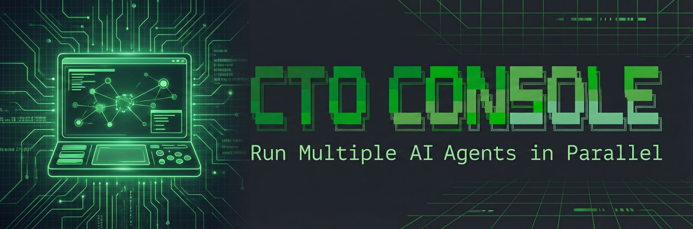

<div align="center">



# CTO Console

**Run Multiple AI Agents in Parallel**

[](https://www.npmjs.com/package/cto-console)
[](https://www.npmjs.com/package/cto-console)
[](https://github.com/StevenzUltra/cto-console/stargazers)
[](LICENSE)
[](https://github.com/StevenzUltra/cto-console/pulls)

[Website](https://stevenzultra.github.io/cto-console) · [Documentation](#quick-start) · [Report Bug](https://github.com/StevenzUltra/cto-console/issues) · [Request Feature](https://github.com/StevenzUltra/cto-console/issues)

</div>

---

## Demo


## Features

- **TUI Console** - Real-time dashboard for managing multiple AI agents
- **Task Management** - Create, assign, and track tasks with dependency support
- **Multi-Agent Support** - Works with Claude, Codex, and Gemini CLI tools
- **tmux Integration** - Each agent runs in its own tmux session
- **Messaging System** - Send messages between agents and broadcast to all

## Installation

```bash
npm install -g cto-console
```

Or install locally:

```bash
git clone https://github.com/StevenzUltra/cto-console.git
cd cto-console
npm link
```

## Prerequisites

- Node.js 18+
- tmux installed (`brew install tmux` on macOS)
- One or more AI CLI tools: `claude`, `codex`, or `gemini`

## Quick Start

### 1. Start the CTO Console

```bash
cto console
```

### 2. Start AI Agents

```bash
# Start Tech Director (TD) with Claude
cto claude 1 TD

# Start Group A with Codex
cto codex 1 A

# Start Group B with Gemini
cto gemini 1 B
```

### 3. Manage Tasks

```bash
# Create a task
cto task "Implement login feature" -d "Add OAuth support"

# Assign task to Group A
cto assign 1 @A

# View all tasks
cto tasks

# Complete a task
cto done 1
```

## Commands

### Console

| Command | Description |
|---------|-------------|
| `cto console` | Open the TUI management console |

### Start Agents

| Command | Description |
|---------|-------------|
| `cto <cli> <projectId> <role>` | Start an agent |
| `cto claude 1 TD` | Start TD with Claude on project 1 |
| `cto codex 1 A` | Start Group A with Codex |

### Task Management

| Command | Description |
|---------|-------------|
| `cto tasks` | List all tasks |
| `cto task "title"` | Create a new task |
| `cto task "title" -d "desc"` | Create task with description |
| `cto assign <n> @<group>` | Assign task n to group |
| `cto done <n>` | Mark task as complete |
| `cto undo <n>` | Mark task as incomplete |
| `cto del <n>` | Delete a task |

### Dependencies

| Command | Description |
|---------|-------------|
| `cto block <n> <m>` | Task n blocks task m |
| `cto unblock <n> <m>` | Remove blocking relationship |

### Messaging

| Command | Description |
|---------|-------------|
| `cto send @<group> "msg"` | Send message to group |
| `cto broadcast "msg"` | Broadcast to all groups |

### Logs

| Command | Description |
|---------|-------------|
| `cto log "content"` | Write a log entry |
| `cto logs` | View all logs |
| `cto logs <groupId>` | View logs for specific group |
| `cto watch` | Watch logs in real-time |

### Project Management

| Command | Description |
|---------|-------------|
| `cto init <name>` | Initialize a new project |
| `cto list` | List all projects |
| `cto status` | Show project status |

## Architecture

```
CTO Console
    │
    ├── Tech Director (TD)
    │       │
    │       ├── Group A (executor)
    │       ├── Group B (executor)
    │       └── Group C (executor)
    │
    ├── Task Queue
    ├── Message Bus
    └── Log Aggregator
```

## Roles

- **TD (Tech Director)**: Manages tasks, assigns work, reviews progress
- **Groups (A/B/C...)**: Execute tasks, report progress, request help

## Console Keyboard Shortcuts

| Key | Action |
|-----|--------|
| `Tab` | Switch between panels |
| `Enter` | Select/Confirm |
| `Esc` | Cancel/Go back |
| `q` | Quit console |
| `r` | Refresh |

## Environment Variables

| Variable | Description |
|----------|-------------|
| `SWARM_PROJECT` | Current project name |
| `SWARM_ROLE` | Current role (TD/A/B/C...) |

## Data Storage

Project data is stored in `~/.agent-swarm/projects/<project-name>/`:

- `config.json` - Project configuration
- `tasks.json` - Task list
- `logs/` - Agent logs
- `inbox/` - Message inbox

## Support the Project

If you find CTO Console useful, please consider supporting its development:

<div align="center">

[](https://github.com/sponsors/StevenzUltra)
[](https://buymeacoffee.com/stevenzultra)
[](https://ko-fi.com/stevenzultra)

</div>

## Star History

<div align="center">

[](https://star-history.com/#StevenzUltra/cto-console&Date)

</div>

## Contributing

Contributions are welcome! Please feel free to submit a Pull Request.

1. Fork the repository
2. Create your feature branch (`git checkout -b feature/AmazingFeature`)
3. Commit your changes (`git commit -m 'Add some AmazingFeature'`)
4. Push to the branch (`git push origin feature/AmazingFeature`)
5. Open a Pull Request

## License

MIT License - see the [LICENSE](LICENSE) file for details.

---

<div align="center">

Made with ❤️ by [StevenzUltra](https://github.com/StevenzUltra)

**[⬆ back to top](#cto-console)**

</div>
